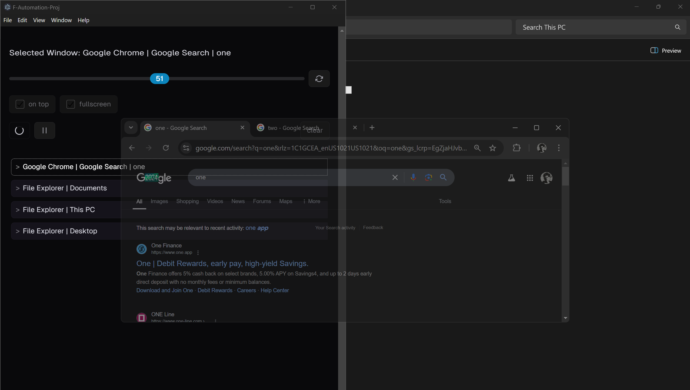

## Window Opacity Control

- demo of ffi-napi with electron
- just experiment

*Windows only*

<!-- screenshot -->

* newest versions of electron do not support `ffi-napi`, use `@lwahonen/ffi-napi` instead. You will also have to install `node-gyp` globally, and if you are still having trouble, you may need to configure `windows-build-tools`

---

* Run `npm install` then `npm start`
* Play and pause buttons tell the app to listen for new windows or pause listening. The app aggregates all windows that the user comes into contact with into a list. Click one of the list items and adjust the slider to change the opacity of that window.
* configured to ignore the app window and IDE window
